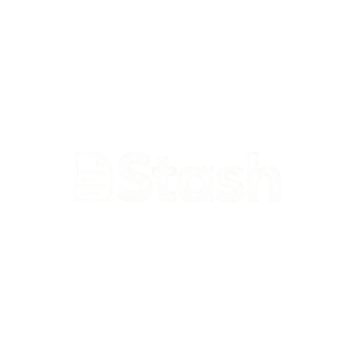
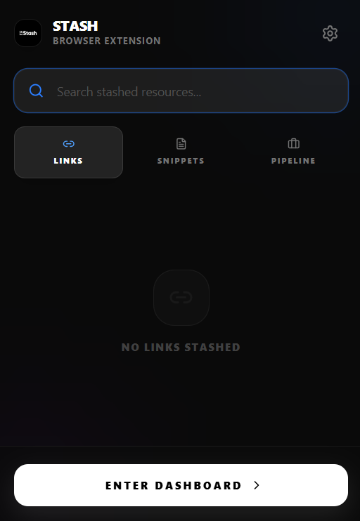
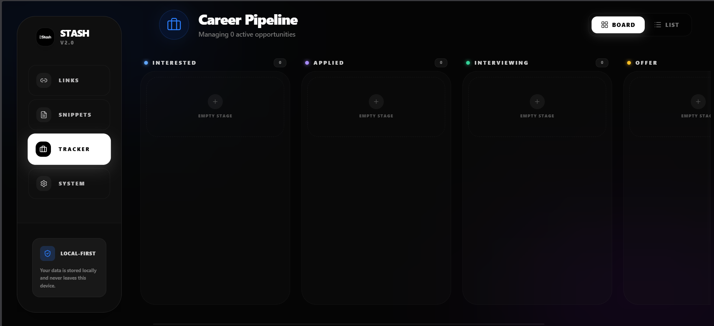
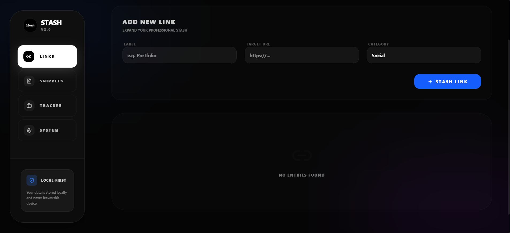
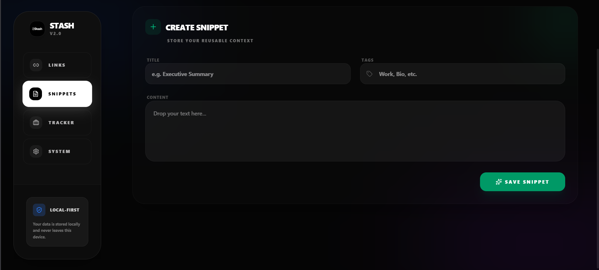
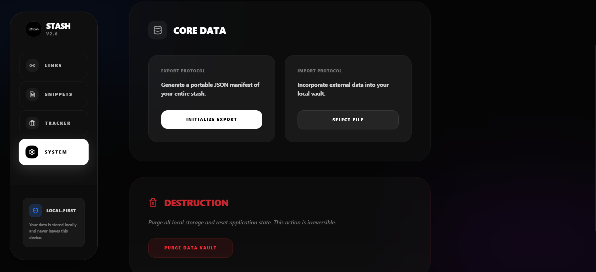

  

<h1 align="center">Stash</h1>

  <b>Local-First Professional Resource Manager & Form Autofiller</b>

  <a href="#📥-download--installation">Download</a> •
  <a href="#✨-features">Features</a> •
  <a href="#📸-screenshots">Screenshots</a> •
  <a href="#🛠️-tech-stack">Tech Stack</a> •
  <a href="#❓-faq">FAQ</a> •
  <a href="#📄-license">License</a>

---

## 📸 Screenshots

<table align="center">
  <tr>
    <td align="center"> Main Dashboard</td>
    <td align="center"> Job Tracker</td>
  </tr>
  <tr>
    <td align="center"> Links Manager</td>
    <td align="center"> Snippet Manager</td>
  </tr>
  <tr>
    <td align="center" colspan="2"> System Settings</td>
  </tr>
</table>

---

**Stash** is a high-utility, context-aware browser extension designed to eliminate the friction of job applications. It transforms your browser into a powerful workspace that detects job postings, injects data into forms, and provides global access to your professional assets—all while keeping your data private and local.

> [!IMPORTANT]
> **Privacy First:** Stash does not use cloud sync. All your data (links, snippets, job history) is stored locally in your browser's IndexedDB. Your data never leaves your device unless you manually export it.

---

## 📥 Download & Installation

The easiest way to use Stash is to download the production-ready bundle from our [Releases](https://github.com/your-username/stash-extension/releases) page.

### 1. Download the Bundle
- Go to the [Releases](https://github.com/your-username/stash-extension/releases) page.
- Download the `stash-extension-v2.0.0.zip` file.
- Extract the ZIP file to a folder on your computer (e.g., `Documents/StashExtension`).

### 2. Enable Developer Mode
- Open your browser (Chrome, Brave, Edge, or any Chromium-based browser).
- Navigate to `chrome://extensions/`.
- In the top-right corner, toggle **Developer mode** to **ON**.

### 3. Load the Extension
- Click the **Load unpacked** button.
- Select the folder where you extracted the extension (the folder containing `manifest.json`).
- Stash is now installed! Pin it to your toolbar for easy access.

---

## ✨ Features

### 📝 Smart Form Injection
Stash automatically detects application fields and provides a one-click "Magic Fill" experience.
- **Context-Aware:** Detects fields like "LinkedIn URL", "Portfolio", or "Phone Number" and offers the correct data.
- **Mutual Exclusion:** Magic Button appears on specific fields, while the general Stash icon appears on career portals to give you access to all your assets.
- **Smart Expansion:** Supports direct career pages of thousands of companies via URL heuristic matching.

### 💼 Frictionless Job Tracking
Never lose track of where you applied.
- **Auto-Detect:** A floating "S" badge appears on LinkedIn, Wellfound, Indeed, and major ATS platforms (Workday, Lever, Greenhouse).
- **One-Click Save:** Instantly stashes the Job Title, Company, and URL.
- **Kanban Board:** Manage your application pipeline (Interested → Applied → Interviewing → Offer) in a sleek, modern dashboard.

### ⚡ Global Command Palette (`Alt + S`)
Access your assets anywhere on the web without a mouse.
- **Spotlight Search:** Search through all your snippets and links instantly.
- **Glassmorphism UI:** A beautiful, non-intrusive interface that works on any website.
- **Keyboard First:** Designed for speed and efficiency.

### 📂 Data Portability
- **JSON Import/Export:** Easily backup your entire local database or move it to a different browser.
- **Data Purge:** One-click option to clear all local data for security.

---

## 🛠️ Tech Stack

- **Frontend:** [React 19](https://react.dev/), [TypeScript](https://www.typescriptlang.org/)
- **Styling:** [GSAP](https://greensock.com/gsap/) (Animations), Vanilla CSS (Glassmorphism), [Tailwind CSS](https://tailwindcss.com/) (Dashboard)
- **Database:** [IndexedDB](https://developer.mozilla.org/en-US/docs/Web/API/IndexedDB_API) + [Dexie.js](https://dexie.org/)
- **Icons:** [Lucide React](https://lucide.dev/)
- **Build Tool:** [Vite](https://vitejs.dev/) + [CRXJS](https://crxjs.dev/)

---

## ❓ FAQ

**Q: Where is my data stored?**  
A: Your data is stored locally in your browser's IndexedDB. It is never uploaded to any server.

**Q: Does this work on all job boards?**  
A: It is optimized for LinkedIn, Indeed, Wellfound, and major ATS platforms like Workday, Lever, and Greenhouse. It also detects most company career portals.

**Q: Is it free?**  
A: Yes, Stash is fully open-source and free to use under the GPL-3.0 license.

---

## 📄 License

Stash is open-source software licensed under the **GNU General Public License v3.0 (GPL-3.0)**. See the [LICENSE](LICENSE) file for more details.

---

Made with ❤️ for the job-seeking community.

